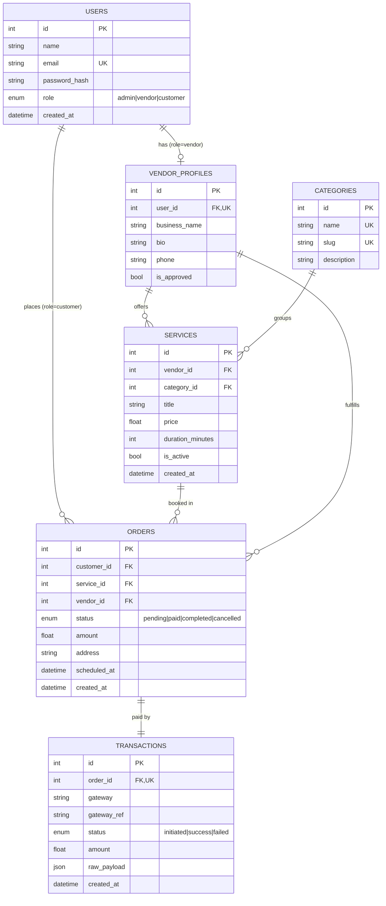

# Entity-Relationship Diagram



## Why the model is shaped this way (multi-tenant safety)

- **`users` carries the role**, so authentication is one table and authorization is a
  single enum check. A `vendor` gets a **`vendor_profiles`** row (1-to-1); services and
  received jobs hang off that profile, never off the raw user — this cleanly separates
  "the person" from "the business".
- **`orders` denormalises `vendor_id`** (alongside `service_id`). It is derivable via
  the service, but storing it makes the vendor's "received jobs" query a direct,
  index-backed filter and keeps the job tied to the vendor even if the service is later
  edited.
- **`transactions` is 1-to-1 with `orders`** via a **unique** `order_id`. The sandbox
  gateway response is persisted verbatim in `raw_payload` (JSON) for auditability, and
  the order only flips to `paid` when the transaction status is `success` — a declined
  charge leaves the order `pending`, so payment state is never ambiguous.
- Every cross-tenant query is scoped by an owning id (`customer_id`, `vendor_id`), which
  is the data-layer half of the tenant isolation that RBAC enforces at the API layer.
```
